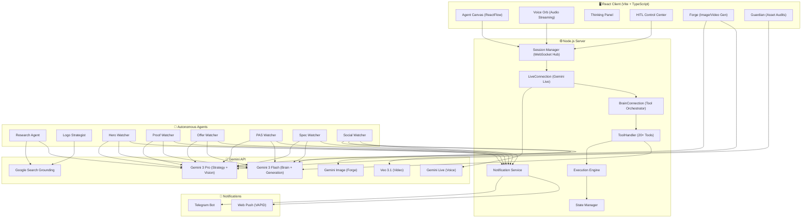

# Beevo — Your Sovereign Virtual CMO

> **The autonomous AI marketing agent that researches your competitors, builds your brand, generates landing pages, and optimizes them continuously—while you sleep.**

<!--  -->

---

## Demo Video

[](YOUR_YOUTUBE_LINK_HERE)
> *3-minute walkthrough showing the full autonomous branding experience*

---

## Live Demo

**[Try Beevo Live →](https://beevo-430715776322.us-central1.run.app) https://beevo-430715776322.us-central1.run.app**

> *Note: Requires microphone access for voice interaction with the AI*

> [!IMPORTANT]
> **For Judges:** The logo inspiration feature uses Puppeteer (headless Chrome) to scrape real brand logos, which does not work reliably on Cloud Run due to Google Images blocking requests from datacenter IPs. **For the full experience, please run the app locally:**
> ```bash
> npm install
> # Terminal 1:
> npm run dev:server
> # Terminal 2:
> npm run dev:client
> ```
> This starts the server (http://localhost:3000) and client (http://localhost:5173) in separate terminals. All other features (voice, palettes, fonts, research, landing pages, watchers) work fine on the deployed version.

---

## Challenge

**Gemini API Developer Competition** — *Build with Gemini*

> "Build new, creative apps and use cases powered by the Gemini API."

---

## What is Beevo?

**Beevo** is an autonomous AI branding agent that turns a 6-week branding process into 6 minutes. It's not a chatbot—it's a full marketing department powered by Gemini.

### The Problem
For small businesses, branding is broken:
- **Expensive** — Hiring a marketing agency costs $15,000+ minimum
- **Slow** — Landing pages take days of back-and-forth with designers
- **Manual** — A/B testing, competitor research, and optimization require dedicated staff
- **Fragmented** — You need 5+ tools (Canva, SEMrush, Webflow, Hotjar, etc.)

Most founders spend 40% of their time on marketing they hate, instead of building what they love.

### Our Solution
Beevo combines multiple Gemini capabilities into a single autonomous agent:
- **Gemini Live API** — Real-time voice conversations to understand your brand vision
- **Google Search Grounding** — Live competitor research with real market data
- **Gemini Vision** — Pixel-precise audits of brand assets and landing page analysis
- **Gemini Image Generation** — Logo kits, campaign images, and social media assets
- **Veo Video Generation** — Cinematic brand videos from text prompts

The result? An AI that **listens** to your brand vision, **researches** your market, **creates** your entire brand identity, **builds** your landing page, and **optimizes** it autonomously.

---

## What Makes Beevo Different?

### 🧠 Dual-Model Bridge Architecture

Beevo uses a unique **Bridge architecture** with two Gemini models working in tandem:

- **Gemini Live** (`gemini-2.5-flash-native-audio`) — Handles real-time voice conversation with the user, providing natural audio responses
- **The Brain** (`gemini-3-flash-preview`) — A separate model that receives batched transcripts and decides when to call tools (create palettes, research competitors, generate assets)

When you speak to Beevo, your voice goes to Gemini Live for conversation. Simultaneously, the Brain analyzes the transcript and autonomously calls tools—creating color palettes, researching competitors, and generating assets without you needing to click anything.

### 🎤 Voice-First Interaction

Talk to Beevo like you'd talk to a real CMO:
- **Gemini Live API** powers real-time bidirectional voice conversations
- **Audio Streaming** via WebSocket with VAD (Voice Activity Detection)
- **Voice Orb** visualizes the conversation with reactive animations
- The AI confirms actions before executing: *"Would you like me to save 'Nike' as your brand name?"*

### 🔍 Live Competitor Research

Not generic templates—**real-time market intelligence** using Google Search Grounding:

1. **Brand Input** — Tell Beevo about your brand via voice
2. **Research Agent** — Uses Google Search to find real competitors in your industry
3. **Aesthetic Analysis** — Analyzes competitor color palettes, domains, and visual identity
4. **Strategic Gap** — Identifies your unique market positioning via SWOT analysis
5. **Differentiated Assets** — Generates palettes and typography positioned against competitors

### 🤖 6 Autonomous Watcher Agents

After generating your landing page, Beevo deploys six specialized agents that **continuously monitor and optimize** each section:

| Watcher | Responsibility |
|---------|---------------|
| **Hero Watcher** | Headline copy, hero visuals, above-the-fold impact |
| **Proof Watcher** | Statistics, trust badges, executive dashboards |
| **Offer Watcher** | CTA copy, pricing presentation, conversion triggers |
| **PAS Watcher** | Problem-Agitate-Solve messaging framework |
| **Spec Watcher** | Feature lists, technical specs, product details |
| **Social Watcher** | Testimonials, social proof, sharing elements |

Each watcher uses the **Nano Banana Design System** (`NanoBananaService`) to generate high-fidelity visual components (layout strategies like SPLIT, CLOUDS, TRIPTYCH, FORENSIC_GRID) and Gemini Vision to analyze real page screenshots for continuous refinement.

### 🛡️ Guardian — Pixel-Precise Asset Auditing

Upload any brand asset, and the Guardian uses **Gemini Vision** (`gemini-3-pro-preview`) to:
- Check if colors match your Brand DNA hex codes
- Detect logo distortion or Safe Zone violations
- Return bounding-box overlays pinpointing exact issues on the image
- Flag content that fails brand guidelines

### 🔥 The Forge — AI Image & Video Generation

Generate campaign assets directly from your Brand DNA:
- **Images** — Uses `gemini-2.5-flash-image` to generate campaign images, social media assets, and advertisements
- **Videos** — Uses `veo-3.1-generate-preview` to create cinematic brand videos with configurable lighting, camera movement, and color grading
- **Logo Kit** — Generates a complete logo kit (primary logo, favicon, wordmark, social profile image) via parallel Gemini calls

### 🏗️ Logo Studio

A dedicated frame on the canvas for logo creation:
- **Logo Structures** — AI recommends logo types (Wordmark, Emblem, Monogram, Pictorial, etc.) based on your brand
- **Logo Inspirations** — Finds real brand logos via Google Search Grounding + Logo.dev API
- **Logo Kit Generation** — Creates primary, inverted, favicon, wordmark, and social media variants

### 👤 Human-in-the-Loop (HITL) Control

The watchers are autonomous, but you stay in control:
- **HITL Control Center** — Approve, reject, or modify any watcher's proposed changes
- **Command Center** — Lock specific sections, adjust performance metrics, and give directives
- **Configurable Intervention** — PRE_GENERATION (ask before creating) or POST_GENERATION (ask after)
- **Auto-Proceed** — Set a timeout; if you don't respond, changes auto-approve
- **Telegram Notifications** — Get notified on your phone when a watcher requests approval
- **Web Push Notifications** — Browser push for desktop alerts

### 🎨 Infinite Brand Canvas

Everything lives on a **ReactFlow-powered infinite canvas** with 24 node types:
- **Palette Nodes** — Interactive color palettes with copy-to-clipboard
- **Typography Nodes** — Live font previews with Google Fonts integration
- **Thought Signature Nodes** — Transparent AI reasoning chains
- **Landing Page Frame** — Live landing page preview with watcher status
- **Logo Studio Frame** — Logo generation workspace
- **Imagery Nodes** — AI-generated brand imagery concepts
- **Vault Node** — Brand DNA summary and document storage
- **Voice Orb Node** — Embedded voice interaction point

---

## Key Features

| Feature | Description |
|---------|-------------|
| **Voice-First Branding** | Talk to your AI CMO via Gemini Live — it listens, confirms, then acts |
| **Live Competitor Research** | Google Search Grounding finds real competitors and analyzes their branding |
| **5 Research Phases** | Vision Analysis → Competitor Research → Aesthetics → Palettes → Typography |
| **6 Watcher Agents** | Autonomous optimization of every landing page section |
| **Logo Studio** | Logo structures, inspirations, and full kit generation |
| **Forge (Image + Video)** | Gemini Image + Veo video generation from brand context |
| **Guardian Audits** | Pixel-precise vision-based brand compliance checking |
| **Nano Banana Design System** | High-fidelity visual component generation (Proof, PAS, Spec, Offer, Social) |
| **HITL Control Center** | Approve/reject watcher changes via web, Telegram, or push notifications |
| **Infinite Canvas** | ReactFlow-based canvas with 24 node types for brand visualization |
| **Workspace Management** | Multiple brand projects with independent state and history |
| **Thought Signatures** | Every AI decision shows transparent reasoning |

---

## Technology Stack

### Gemini Models Used

| Model | Identifier | Purpose |
|-------|-----------|---------|
| **Gemini 3 Pro** | `gemini-3-pro-preview` | Strategic reasoning (Strategist SWOT), Guardian Vision audits |
| **Gemini 3 Flash** | `gemini-3-flash-preview` | Brain tool orchestration, asset generation, watcher refinement |
| **Gemini Live** | `gemini-2.5-flash-native-audio-preview` | Real-time bidirectional voice conversation |
| **Gemini Image** | `gemini-2.5-flash-image` | Logo kits, campaign images, social media assets |
| **Veo 3.1** | `veo-3.1-generate-preview` | Cinematic video generation |

### How Gemini Is Used

#### 1. Voice Interaction — Gemini Live API (`LiveConnection.ts`)
```
Input: Real-time PCM audio stream via WebSocket
Process: Bidirectional voice conversation + VAD turn management
Output: AI voice responses + transcript buffered for Brain analysis
```

#### 2. Tool Orchestration — The Brain (`BrainConnection.ts`)
```
Input: Batched conversation transcripts from Live
Process: Gemini 3 Flash with 20+ function declarations
Output: Tool calls (create_color_palette, start_brand_research, etc.)
Tools: update_brand_name, update_mission, create_color_palette,
       select/unselect/delete palettes, create_fonts, create_logo_structures,
       create_logo_inspirations, create_imagery, general_research, etc.
```

#### 3. Competitor Research — Search Grounding (`ResearchAgent.ts`, `SearchGroundingService.ts`)
```
Input: Brand name + industry
Process: Google Search Grounding → competitor discovery → SWOT analysis
Output: Competitor list, color analysis, strategic gap, differentiation strategy
```

#### 4. Asset Generation — Forge (`gemini.ts`)
```
Images: gemini-2.5-flash-image → campaign images, logo kits (4 parallel calls)
Videos: veo-3.1-generate-preview → cinematic videos with polling
Audits: gemini-3-pro-preview → vision-based pixel-precise asset auditing
```

#### 5. Landing Page Generation — Nano Banana System (`NanoBananaService.ts`)
```
Input: Brand DNA + selected assets
Process: Generate structured JSON configs for each section type
Sections: Hero, Proof (stats/dashboard), PAS (Problem-Agitate-Solve),
          Spec (features), Social (testimonials), Offer (pricing/CTA)
Layouts: SPLIT, CLOUDS, TRIPTYCH, FORENSIC_GRID
```

#### 6. Continuous Optimization — Watcher Agents (`HeroWatcher.ts`, etc.)
```
Process: Capture screenshot → Gemini Vision analysis → Gemini Flash refinement
Result: Updated section content pushed to client via WebSocket
HITL: Watchers request approval before/after changes via NotificationService
```

---

### Frontend Stack
- **React + TypeScript** (Vite) — Fast development with HMR
- **ReactFlow** — Infinite canvas with 24 custom node types
- **Zustand** — State management (`useBrandStore`, `useActivityStore`)
- **WebSocket** — Real-time bidirectional communication with server
- **Lucide React** — Icon library

### Backend Stack
- **Node.js + Express + WebSocket** — Unified HTTP + WS server
- **TypeScript (tsx)** — Runtime TypeScript compilation (no build step)
- **Google GenAI SDK** (`@google/genai`) — All Gemini API calls
- **Puppeteer** — Logo research via headless Chrome (stealth mode)
- **SQLite** (`better-sqlite3`) — Analytics and metrics storage
- **uuid** — Unique ID generation for interventions

### Services
- **`StateManager`** — Persists workspace state with versioned history, emits events
- **`SessionManager`** — WebSocket hub, broadcasts `FULL_STATE_UPDATE` to clients
- **`ExecutionEngine`** — Orchestrates 20+ tools (palette creation, font generation, etc.)
- **`NanoBananaService`** — High-fidelity visual component generation
- **`SearchGroundingService`** — Gemini Search Grounding for logo discovery
- **`NotificationService`** — HITL intervention queue with debounced broadcasting
- **`TelegramService`** — Telegram bot integration for mobile notifications
- **`PushService`** — Web Push (VAPID) notifications
- **`MetricsService`** — Analytics tracking and metrics storage
- **`MediaService`** — File uploads and media handling
- **`VideoGenerator`** — Veo video generation with operation polling
- **`DatabaseService`** — SQLite-based persistent storage
- **`SystemConfigService`** — Per-workspace configuration management

### Infrastructure
- **Google Cloud Run** — Containerized deployment
- **Google Cloud Build** — Docker build pipeline
- **Docker** — Multi-stage build with Google Chrome for Puppeteer

---

## Architecture



### Data Flow

```mermaid
sequenceDiagram
    participant U as User
    participant F as Frontend
    participant Live as Gemini Live
    participant Brain as Brain (Gemini Flash)
    participant G as Gemini APIs
    participant S as State Manager

    U->>F: Speak into Voice Orb
    F->>Live: Audio Stream (WebSocket)
    Live-->>F: AI Voice Response
    Live->>Brain: Buffered Transcript

    rect rgb(40, 40, 60)
        Note over Brain,G: Brain Tool Decisions
        Brain->>Brain: Analyze transcript, decide tools
        Brain->>G: start_brand_research
        G-->>Brain: Competitor data (Search Grounding)
        Brain->>G: create_color_palette
        G-->>Brain: Generated palettes (JSON)
        Brain->>G: create_fonts
        G-->>Brain: Typography pairings
    end

    Brain->>S: Save state (versioned)
    S-->>F: FULL_STATE_UPDATE (WebSocket broadcast)
    F->>F: Canvas renders new nodes

    rect rgb(60, 40, 40)
        Note over F,G: Watcher Loop (Autonomous)
        loop Every cycle
            F->>G: Screenshot → Vision analysis
            G-->>F: Improvement suggestions
            F->>G: Flash → Rewrite section
            G-->>F: Optimized content
            F->>U: HITL: Request approval?
        end
    end
```



---

## Getting Started

### Prerequisites
- Node.js v18+
- npm
- A Gemini API Key ([Get one here](https://aistudio.google.com/apikey))

### 1. Clone the Repository
```bash
git clone https://github.com/excel-asaph/beevo.git
cd beevo
```

### 2. Install Dependencies
```bash
npm install
```

### 3. Configure Environment

Create a `.env.local` file in the project root:
```env
GEMINI_API_KEY=your_gemini_api_key

# Optional: Google Custom Search (for competitor research)
GOOGLE_SEARCH_API_KEY=your_google_search_api_key
GOOGLE_SEARCH_CX=your_custom_search_engine_id

# Optional: Telegram Bot (for HITL mobile notifications)
TELEGRAM_BOT_TOKEN=your_telegram_bot_token
TELEGRAM_BOT_USERNAME=your_bot_username

# Optional: Web Push (VAPID keys for browser notifications)
VAPID_PUBLIC_KEY=your_vapid_public_key
VAPID_PRIVATE_KEY=your_vapid_private_key
VAPID_EMAIL=mailto:your@email.com
```

### 4. Run the Development Server
```bash
npm run dev
```

This starts both the client and server concurrently:
- **Client** (Vite): http://localhost:5173
- **Server** (tsx): http://localhost:3000

### Other Commands
```bash
npm run init:system    # Run system initializers (initial generators)
npm run start:watchers # Start the 6 watcher agents
npm run db:check       # Check database state
```

---

## Deployment (Google Cloud Run)

```bash
# Build Docker image (includes Google Chrome for Puppeteer)
gcloud builds submit --tag gcr.io/YOUR_PROJECT_ID/beevo

# Deploy to Cloud Run
gcloud run deploy beevo \
  --image gcr.io/YOUR_PROJECT_ID/beevo \
  --platform managed \
  --region us-central1 \
  --allow-unauthenticated \
  --memory 2Gi \
  --cpu 2 \
  --set-env-vars "GEMINI_API_KEY=your_key"
```

| Service | URL |
|---------|-----|
| **Beevo** | https://beevo-430715776322.us-central1.run.app |

---

## Project Structure

```
beevo/
├── client/                     # React Frontend (Vite + TypeScript)
│   ├── src/
│   │   ├── components/
│   │   │   ├── Agent/          # Canvas, 24 node types, WorkspaceLanding
│   │   │   ├── Architect/      # Chat interface, voice controls
│   │   │   ├── LogoStudio/     # Logo generation workspace
│   │   │   ├── Blocks/         # Reusable UI blocks
│   │   │   ├── Analytics/      # Analytics dashboard
│   │   │   ├── Forge.tsx       # Image & video generation
│   │   │   ├── Guardian.tsx    # Pixel-precise asset auditing
│   │   │   ├── Strategist.tsx  # SWOT analysis interface
│   │   │   ├── HITLControlCenter.tsx  # Human-in-the-Loop controls
│   │   │   └── DynamicLandingPage.tsx # Live landing page preview
│   │   ├── hooks/              # useWebSocket, useAgent, useAudioStream, etc.
│   │   ├── stores/             # useBrandStore, useActivityStore (Zustand)
│   │   ├── context/            # BrandContext, WorkspaceContext
│   │   └── services/gemini.ts  # Client-side Gemini API calls
│   └── package.json
├── server/                     # Node.js Backend (Express + WebSocket)
│   ├── src/
│   │   ├── agents/             # 15 agents total:
│   │   │   ├── ResearchAgent.ts          # Google Search Grounding
│   │   │   ├── LogoStrategist.ts         # Puppeteer-based logo research
│   │   │   ├── HeroWatcher.ts            # Hero section optimizer
│   │   │   ├── ProofWatcher.ts           # Social proof optimizer
│   │   │   ├── OfferWatcher.ts           # CTA/pricing optimizer
│   │   │   ├── PASWatcher.ts             # Problem-Agitate-Solve optimizer
│   │   │   ├── SpecWatcher.ts            # Features/specs optimizer
│   │   │   ├── SocialWatcher.ts          # Testimonials optimizer
│   │   │   └── Initial*Generator.ts (×6) # First-pass content generators
│   │   ├── gemini/
│   │   │   ├── LiveConnection.ts         # Gemini Live (voice)
│   │   │   ├── BrainConnection.ts        # Tool orchestrator (20+ tools)
│   │   │   ├── ToolHandler.ts            # Tool execution engine
│   │   │   └── SearchGroundingService.ts # Logo search via Grounding
│   │   ├── services/
│   │   │   ├── ExecutionEngine.ts        # Core asset generation
│   │   │   ├── NanoBananaService.ts      # Visual component system
│   │   │   ├── StateManager.ts           # Versioned state persistence
│   │   │   ├── NotificationService.ts    # HITL intervention queue
│   │   │   ├── TelegramService.ts        # Telegram bot integration
│   │   │   ├── PushService.ts            # Web Push (VAPID)
│   │   │   ├── VideoGenerator.ts         # Veo video generation
│   │   │   ├── MetricsService.ts         # Analytics/metrics
│   │   │   └── DatabaseService.ts        # SQLite storage
│   │   ├── sessions/SessionManager.ts    # WebSocket hub + broadcasting
│   │   └── index.ts                      # Server entry point (1132 lines)
│   └── package.json
├── shared/                     # Shared types, constants, messages
│   ├── types.ts                # BrandDNA, ColorPalette, LogoInspiration, etc.
│   ├── constants.ts            # Model IDs, system instructions, audio config
│   └── messages.ts             # WebSocket message type definitions
├── Dockerfile                  # Multi-stage build (Chrome + Node 18)
└── package.json                # Root workspace config (client + server + shared)
```

---

## Learnings & Challenges

### What We Learned

1. **The Bridge Architecture is powerful** — Separating voice (Gemini Live) from tool orchestration (Brain) allows natural conversation while autonomously executing complex multi-step workflows.

2. **Google Search Grounding enables real competitive intelligence** — Unlike static databases, live search gives Beevo up-to-the-minute market awareness for brand positioning.

3. **Autonomous agents need guardrails** — The HITL system (with Telegram + Push + auto-proceed) is essential. Without it, the watchers can optimize in unexpected directions.

### Challenges Faced

1. **WebSocket state synchronization** — Managing real-time state across multiple clients, 6 watcher agents, and the server required a custom `StateManager` with EventEmitter-based broadcasting and versioned history.

2. **Puppeteer in Cloud Run** — Running headless Chrome in containers required installing Google Chrome Stable, setting `PUPPETEER_EXECUTABLE_PATH`, and using `--single-process` and `--no-zygote` flags. Google Images also blocks scraping from datacenter IPs, requiring fallback to Search Grounding.

3. **Voice + Function Calling coordination** — Gemini Live handles voice but doesn't call tools directly. We buffer transcripts and flush them to the Brain model, which then decides tool calls—requiring careful pause/resume management to avoid audio interrupting tool execution.

4. **Nano Banana visual fidelity** — Generating structured JSON for complex layouts (SPLIT, CLOUDS, TRIPTYCH, FORENSIC_GRID) required extensive prompt engineering with layout-specific constraints passed to Gemini.

---

## 👥 Team

| Name | Role |
|------|------|
| **Excel Asaph** | Full-Stack Developer & Product Designer |

---

## License

This project is licensed under the Apache License 2.0 — see the [LICENSE](LICENSE) file for details.

---

<div align="center">

**Beevo turns a 6-week branding process into 6 minutes.**

*Your Sovereign Virtual CMO — Available 24/7.*

*Built with Gemini 🧠*

</div>

