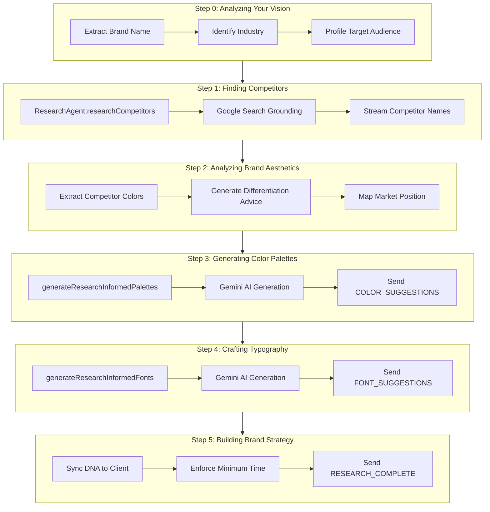

# Research Phases Breakdown

This document details the 5 research phases displayed in the Research Screen UI.

---

## Overview

The Research Screen is orchestrated by **`ToolHandler.ts`** on the server and rendered by **`ResearchScreen.tsx`** on the client. Each phase corresponds to a `stepIndex` (0-4) and is driven by the `streamThought()` helper function, which sends `RESEARCH_UPDATE` WebSocket messages to the client.



---

## Phase 0: Analyzing Your Vision

| Field | Value |
|-------|-------|
| **Label** | "Analyzing your vision" |
| **Icon** | Target |
| **stepIndex** | `0` |
| **Status** | `started` |

### Input
- `brandName` from `getDNA().name`
- `conversationHistory` (passed from Gemini Live)
- `currentDNA` state (to identify gaps)

### Tools Called
- **`BrandExtractor.extractMissingIdentity()`**
  - Lives in: `server/src/utils/BrandExtractor.ts`
  - Uses: **Gemini 3 Flash Preview** (fast text analysis)
  - Returns: `mission`, `values`, `voice`, `tagline`, `industry`
  - **Condition**: Only runs if there are missing fields in the DNA.

### What It Does
```typescript
await streamThought(0, `Extracting brand essence: "${brandName}"...`, 600);

// Check for gaps in DNA (mission, values, etc.)
const gaps = identifyGaps(extractDNA());

if (gaps.length > 0) {
    await streamThought(0, `Analyzing conversation context...`, 500);
    // Call BrandExtractor utility
    const extracted = await extractMissingIdentity(history, currentDNA);
    
    if (Object.keys(extracted).length > 0) {
       await streamThought(0, `Inferred ${extractedCount} brand fields ✓`, 400);
       this.updateBatch(extracted); // Save to DNA immediately
    }
}

await streamThought(0, `Brand: ${brandName} ✓`, 450);
await streamThought(0, `Industry: ${industry} ✓`, 450);
await streamThought(0, `Target audience profiled ✓`, 400);
```

### Output
- **State Change**: Updates `BrandDNA` with extracted fields (Mission, Values, Voice, etc.)
- **Logs**: Detailed extraction results in `research_debug.log`
- **UI**: Visual feedback that analysis is happening

### Why It Exists
- **Data Completeness**: Ensures we have a full "Brand DNA" profile before starting external research.
- **Contextual Intelligence**: Uses the conversation history to fill in details the user didn't explicitly type but mentioned verbally.
- **User Trust**: Shows the system understands the qualitative aspects of their brand.

---

## Phase 1: Finding Competitors

| Field | Value |
|-------|-------|
| **Label** | "Finding competitors" |
| **Icon** | Search |
| **stepIndex** | `1` |
| **Status** | `searching` |

### Input
- `industry` (from Phase 0)
- `brandName` (from DNA)

### Tools Called
- **`ResearchAgent.researchCompetitors()`**
  - Lives in: `server/src/agents/ResearchAgent.ts`
  - Uses: **Gemini 3 Flash with Google Search Grounding** (`google_search` tool)
  - Returns:
    - `competitors: CompetitorInfo[]` (name, domain, description)
    - `differentiationOpportunity: string`
    - `competitorBranding: { primaryColor, secondaryColor }[]`

### What It Does
```typescript
await streamThought(1, `🔍 Searching Google for ${industry} competitors...`, 800);

const researchResult = await researchAgent.researchCompetitors(industry, ...);
liveCompetitors = researchResult.competitors;
differentiationAdvice = researchResult.differentiationOpportunity;
competitorColors = researchResult.competitorBranding.flatMap(cb => [cb.primaryColor, cb.secondaryColor]);

for (const comp of liveCompetitors) {
    await streamThought(1, `Found: ${comp.name} (${comp.domain})`, 400);
}
await streamThought(1, `${liveCompetitors.length} competitors identified ✓`, 500);
```

### Output
- `streamedCompetitors: string[]` - Competitor names (sent to client for logo rendering)
- `differentiationAdvice: string` - Strategic insight for color generation
- `competitorColors: string[]` - Hex codes to avoid

### Why It Exists
- **Live Intelligence**: Uses real-time Google Search to find actual competitors, not hardcoded data.
- **Strategic Context**: The differentiation advice and competitor colors directly inform the palette generation (to stand out).
- **Visual Proof**: Competitor logos are rendered in the UI to show active research.

---

## Phase 2: Analyzing Brand Aesthetics

| Field | Value |
|-------|-------|
| **Label** | "Generating color palettes" (UI mislabel, actually Aesthetics Analysis) |
| **Icon** | Palette |
| **stepIndex** | `2` |
| **Status** | `analyzing` |

### Input
- `differentiationAdvice` (from Phase 1)
- `competitorColors` (from Phase 1)

### Tools Called
- **None directly** (this phase is a transition/summary of research output)

### What It Does
```typescript
await streamThought(2, `Analyzing competitor color strategies...`, 600);
if (differentiationAdvice) {
    await streamThought(2, `💡 ${differentiationAdvice.slice(0, 100)}...`, 500);
}
await streamThought(2, `Identifying differentiation opportunities...`, 500);
await streamThought(2, `Market position mapped ✓`, 400);
```

### Output
- No new data; streams the differentiation insight to the user.

### Why It Exists
- **Strategic Summary**: Displays the AI's "thinking" about how to differentiate the brand.
- **Bridging Phase**: Prepares the user for the actual color generation step.
- **Confidence Building**: Shows the user that a strategy is being applied, not just random palettes.

---

## Phase 3: Generating Color Palettes

| Field | Value |
|-------|-------|
| **Label** | "Generating color palettes" |
| **Icon** | Palette |
| **stepIndex** | `3` |
| **Status** | `generating` |

### Input
- `brandName`
- `industry`
- `differentiationAdvice`
- `competitorColors` (to avoid)
- `mood` (from `args.mood_filter` or default `'modern'`)
- `count` (from `args.palette_count` or default `3`)

### Tools Called
- **`generateResearchInformedPalettes()`**
  - Lives in: `ToolHandler.ts` (private method)
  - Uses: **Gemini 2.0 Flash** (`gemini-2.0-flash`)
  - Prompt instructs AI to:
    1. Avoid competitor colors
    2. Follow differentiation advice
    3. Match the target mood
    4. Return JSON array of palettes

### What It Does
```typescript
const aiPalettes = await this.generateResearchInformedPalettes(
    brandName, industry, differentiationAdvice, competitorColors, mood, count
);

await streamThought(3, `Generating ${paletteCount} unique palettes...`, 600);
await streamThought(3, `Avoiding competitor overlap...`, 200);
for (const palette of palettes.slice(0, 3)) {
    await streamThought(3, `Creating "${palette.name}" palette...`, 300);
}
await streamThought(3, `Color harmony validated ✓`, 400);

this.sendToClient({ type: 'COLOR_SUGGESTIONS', palettes });
```

### Output
- `palettes: ColorPalette[]` - Array of `{ name, colors, vibe }`
- Sends `COLOR_SUGGESTIONS` message to client
- Sends `THOUGHT_SIGNATURE` for the "Color Psychology Strategy" node

### Why It Exists
- **Core Deliverable**: This is the primary visual output of the research phase.
- **AI-Driven**: Palettes are uniquely generated based on research, not hardcoded.
- **Differentiation**: Explicitly avoids competitor colors for strategic positioning.

---

## Phase 4: Crafting Typography

| Field | Value |
|-------|-------|
| **Label** | "Crafting typography" |
| **Icon** | Type |
| **stepIndex** | `4` |
| **Status** | `generating` |

### Input
- `industry`
- `brandName`

### Tools Called
- **`generateResearchInformedFonts()`**
  - Lives in: `ToolHandler.ts` (private method)
  - Uses: **Gemini 2.0 Flash** (`gemini-2.0-flash`)
  - Prompt instructs AI to select 3 real Google Fonts

### What It Does
```typescript
await streamThought(4, `Analyzing typography trends for ${industry}...`, 500);

let fonts = await this.generateResearchInformedFonts(industry, brandName);

for (const font of fonts) {
    await streamThought(4, `Selecting font: ${font.name} (${font.category})...`, 400);
}
await streamThought(4, `Typography pairing complete ✓`, 350);

this.sendToClient({ type: 'FONT_SUGGESTIONS', fonts, previewText: brandName });
this.updateBatch({ typography: fonts.map(f => f.name) });
```

### Output
- `fonts: FontSuggestion[]` - Array of `{ name, category, reasoning }`
- Sends `FONT_SUGGESTIONS` message to client
- Saves font names to DNA via `updateBatch()`
- Sends `THOUGHT_SIGNATURE` for the "Typography Selection" node

### Why It Exists
- **Holistic Branding**: A brand needs more than colors; typography is critical.
- **AI Expertise**: Avoids hardcoded font lists; uses AI to match industry context.
- **Persistence**: Fonts are immediately saved to DNA so they aren't lost.

---

## Phase 5: Building Brand Strategy

| Field | Value |
|-------|-------|
| **Label** | "Building brand strategy" |
| **Icon** | Sparkles |
| **stepIndex** | `5` |
| **Status** | `generating` → `complete` |

### Input
- Complete DNA state (all collected data)
- `researchStartTime` (to enforce minimum duration)

### Tools Called
- **None** (this phase finalizes and syncs)

### What It Does
```typescript
await streamThought(5, `Finalizing brand strategy...`, 500);

const currentDNA = this.getDNA();
this.sendToClient({ type: 'DNA_UPDATE', dna: currentDNA });
await streamThought(5, `Brand Strategy data synced ✓`, 300);

await streamThought(5, `Tagline and values alignment check...`, 400);

// Enforce minimum research time (20 seconds)
const elapsed = Date.now() - researchStartTime;
if (elapsed < MINIMUM_RESEARCH_TIME) {
    await streamThought(5, `Finalizing recommendations...`, MINIMUM_RESEARCH_TIME - elapsed);
}
await streamThought(5, `Strategy complete ✓`, 400);

// Mark all thoughts complete
allThoughts = allThoughts.map(t => ({ ...t, status: 'complete' }));
this.sendToClient({ type: 'RESEARCH_UPDATE', status: 'complete', ... });

// FINAL SIGNAL: Canvas can now be revealed
this.sendToClient({ type: 'RESEARCH_COMPLETE', summary: { ... } });
```

### Output
- `DNA_UPDATE` message (syncs brand data to client)
- `RESEARCH_UPDATE` with `status: 'complete'`
- `RESEARCH_COMPLETE` message (triggers canvas reveal)

### Why It Exists
- **State Sync**: Ensures all collected data is pushed to the client.
- **Minimum Research Time**: Enforces a 20-second minimum so users don't feel rushed.
- **Canvas Reveal Trigger**: The `RESEARCH_COMPLETE` message is the gate that allows `BrandBoard.tsx` to show the canvas.
- **Closure**: Provides a clean "done" state for the research phase.

---

## Summary Table

| Phase | stepIndex | Label | Input | Tool/API | Output |
|-------|-----------|-------|-------|----------|--------|
| 0 | 0 | Analyzing your vision | brandName, industry | None | UX confirmation |
| 1 | 1 | Finding competitors | industry, brandName | ResearchAgent (Google Search Grounding) | competitors[], differentiationAdvice, competitorColors[] |
| 2 | 2 | Generating color palettes | differentiationAdvice, competitorColors | None (summary) | Streams strategy insight |
| 3 | 3 | Generating color palettes | brandName, industry, advice, colors | generateResearchInformedPalettes (Gemini) | palettes[], COLOR_SUGGESTIONS |
| 4 | 4 | Crafting typography | industry, brandName | generateResearchInformedFonts (Gemini) | fonts[], FONT_SUGGESTIONS |
| 5 | 5 | Building brand strategy | Full DNA | None (sync) | DNA_UPDATE, RESEARCH_COMPLETE |
